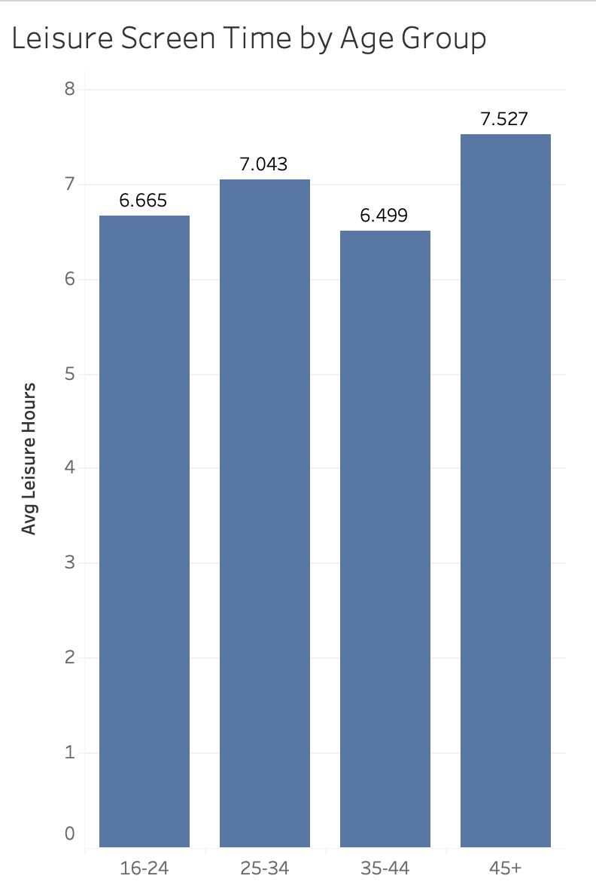
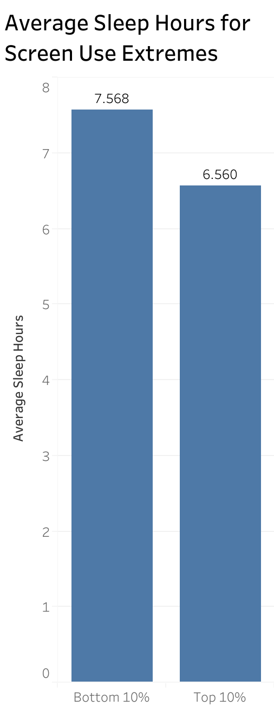
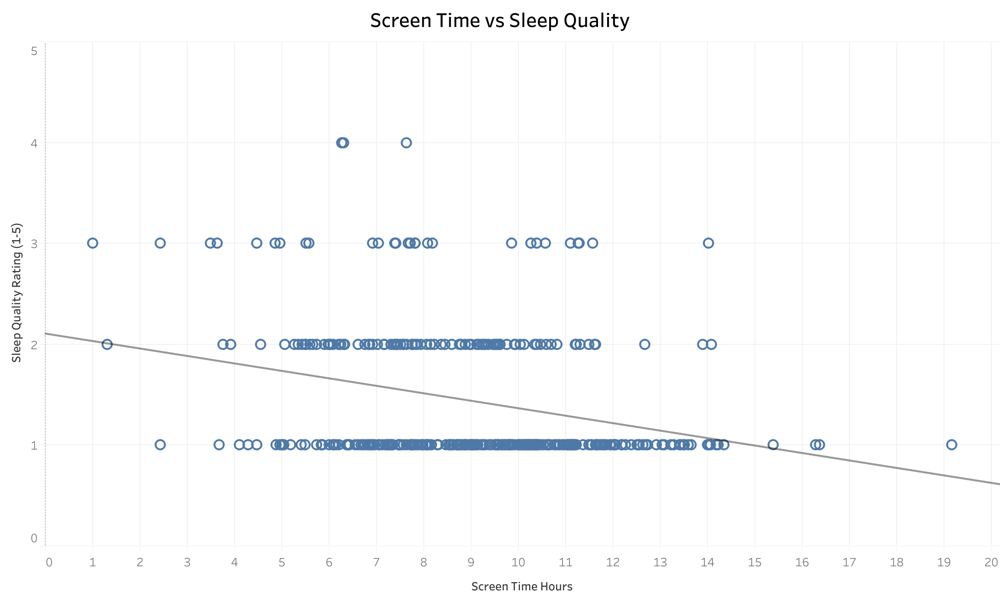
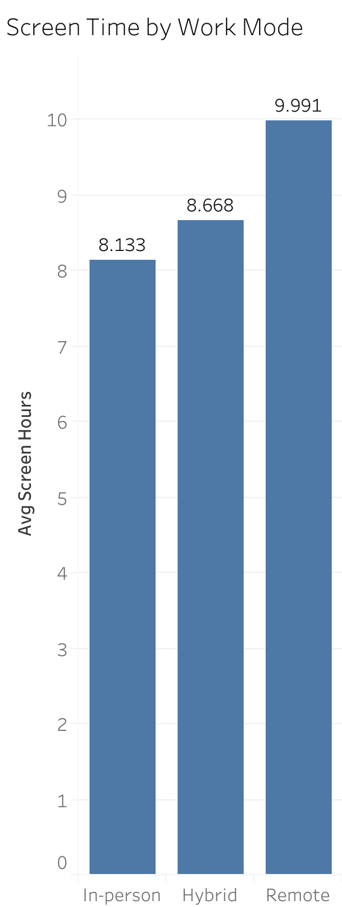
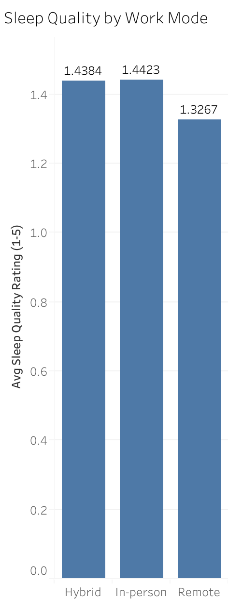

# Screen Time and Sleep Analysis
Project Goal: Explore relationships between screen time, work mode, and sleep patterns.

Dataset: Mental Wellness & Screen Time Survey (400 participants).

## Variables:
- screen_time_hours
- leisure_screen_hours
- sleep_hours
- sleep_quality_1_5
- work_mode
- age
    
SQL analysis performed in Google BigQuery and visualizations created in Tableau.

## Question 1: Do younger users spend more leisure time on their phones?
Result: Users in the 45+ age group reported the highest average leisure screen time, but this may be heavily influenced by a single outlier (16 hours/day). Median or trimmed averages may give a more representative view of typical screen use.

## Question 2: Do extreme screen users sleep less?
Results: Participants in the top 10% of screen time sleep roughly **1 hour less per night** than those in the lowest 10%.

## Question 3: Does higher screen time relate to poorer sleep quality?
Results: Correlation between screen time and sleep quality **r = -0.27**, indicating a moderate negative relationship.

## Question 4: Do remote workers have higher screen time?
Results: Remote workers report **highest average daily screen time** compared to other work modes.
   

## Question 5: Do remote workers report lower sleep quality?
Results: Remote workers show slightly **lower average sleep quality** scores compared to hybrid and in-person workers.
   
## Tools Used:
- Google BigQuery (SQL analysis)
- Tableau (visualizations)
- GitHub (project documentation)

# Insights & Conclusions
- **Work mode and screen time:** Remote workers spend the most time on screens, followed by hybrid, then in-person workers. This suggests that working outside of the office may increase daily screen exposure.
- **Screen time and sleep:** Higher total screen time is associated with lower sleep duration and poorer sleep quality, especially among the top 10% of screen users.
- **Age differences:** Contrary to expectations, older participants reported higher leisure screen time than younger participants. These results may have been influenced by a single user. This highlights the importance of considering outliers when interpreting and indicates that screen habits may not be solely driven by age.
- **Implications:** The combination of high screen time and remote work may impact mental wellness through reduced sleep or lower sleep quality. Future studies could explore time-of-day screen usage, screen breaks, or interventions to improve sleep among heavy screen users.
